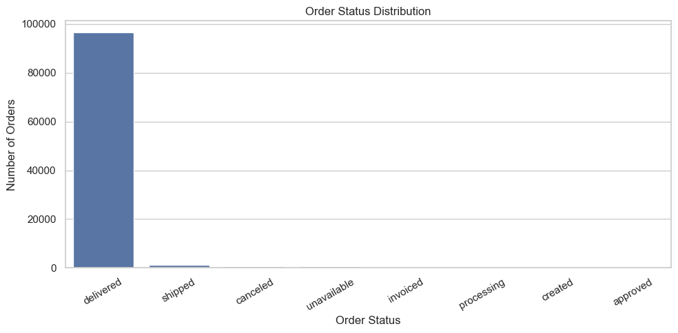
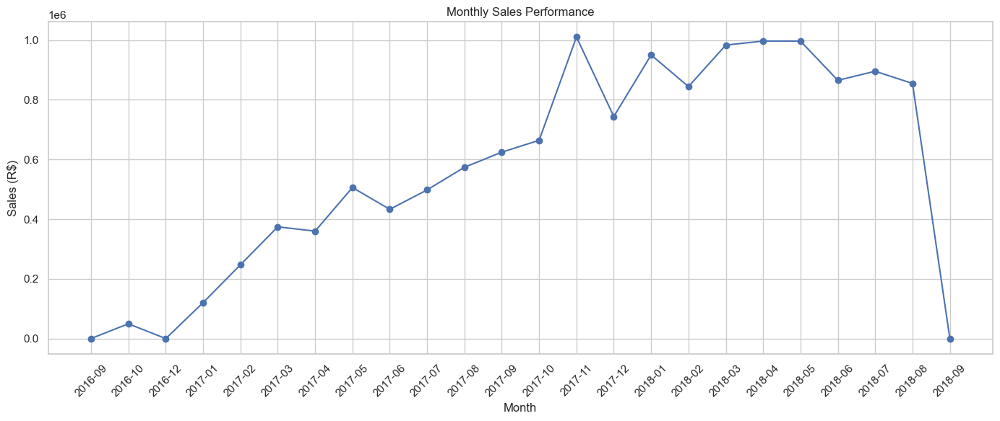
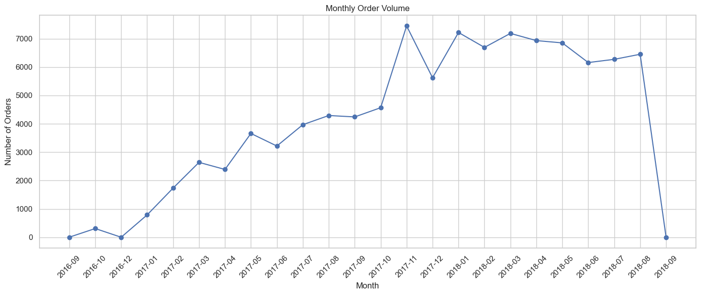
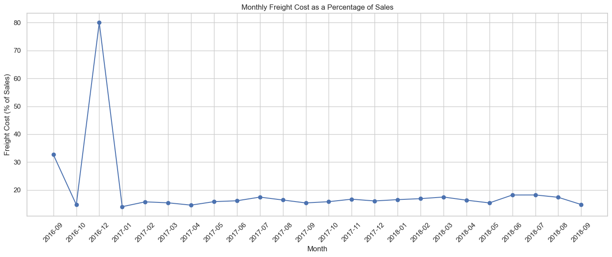
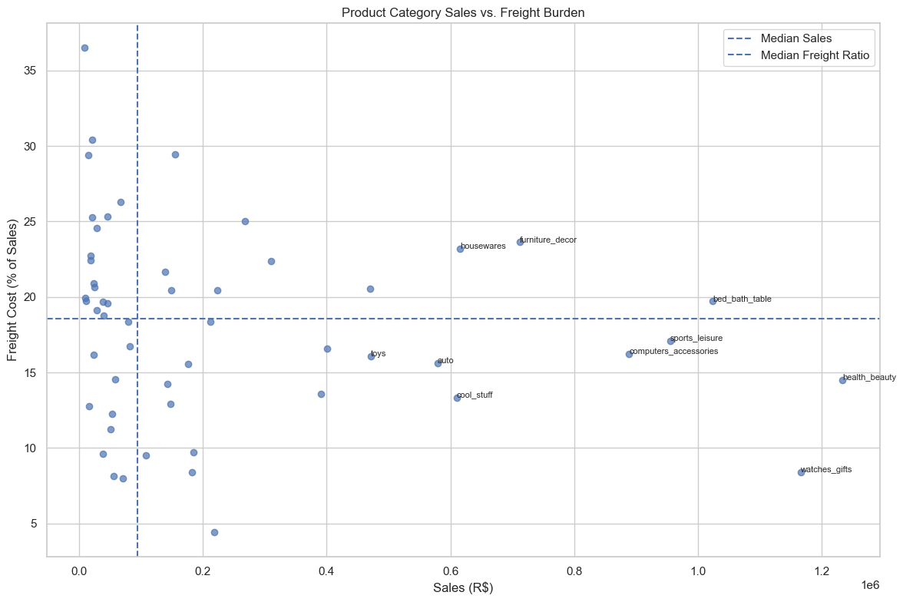
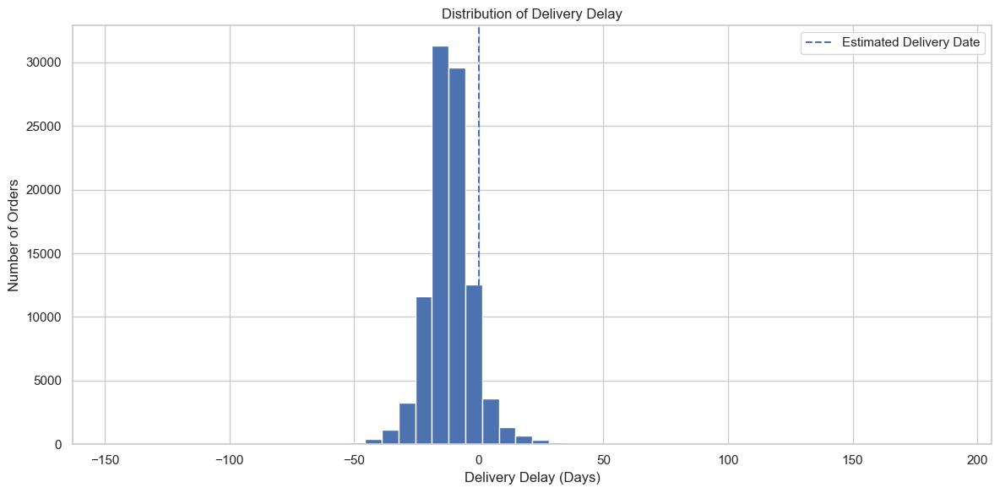
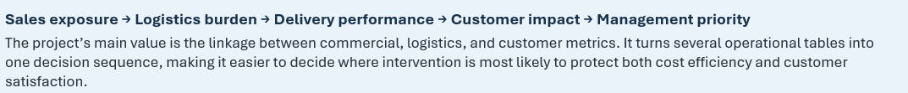

# E-Commerce Operations & Logistics Performance Analysis

A management-focused Python analysis of the Brazilian Olist e-commerce dataset, connecting sales performance, freight efficiency, delivery reliability, and customer satisfaction.

  

  

  <strong>Management-focused analysis of sales performance, freight efficiency, delivery reliability, and customer impact.</strong>

---

# Executive Overview

The objective of this project is to identify **where operational improvements can create the greatest business impact**.

The analysis connects four management questions:

  <strong>Where is the sales value?</strong> &nbsp;→&nbsp;
  <strong>Where is freight disproportionately high?</strong> &nbsp;→&nbsp;
  <strong>Where are deliveries failing?</strong> &nbsp;→&nbsp;
  <strong>How does that affect customers?</strong>

  

> **Executive signal:** delivered orders dominate the order lifecycle, allowing realized commercial and logistics performance to be evaluated on a strong operating base.

---

# 01. Commercial Performance

  

  
  

### What the business is doing

| KPI | Result |
|---|---:|
| Gross item sales | **R$13.59M** |
| Realized sales | **R$13.22M** |
| Delivered orders | **96,478** |
| Sales realization rate | **97.28%** |
| Realized average order value | **R$137.04** |

### Management interpretation

The business converts the vast majority of transactional value into delivered sales. The **97.28% realization rate** supports using delivered orders as the core management baseline for evaluating freight efficiency, delivery performance, and customer outcomes.

> **Commercial takeaway:** performance is driven by substantial delivered-order volume, so operational improvements at scale can have meaningful financial impact.

---

# 02. Freight Efficiency & Category Prioritization

  

  
  

### Where logistics deserves management attention

The analysis evaluates freight **relative to sales**, not only as an absolute expense. This reveals categories that are commercially important but consume a disproportionate share of logistics cost.

| Priority category | Sales | Freight / Sales |
|---|---:|---:|
| Bed & Bath | **R$1.02M** | 20% |
| Furniture & Decor | **R$711.9K** | 24% |
| Housewares | **R$615.6K** | 23% |
| Garden Tools | **R$470.5K** | 21% |
| Telephony | **R$309.9K** | 22% |
| Office Furniture | **R$268.2K** | 25% |
| Electronics | **R$155.0K** | 29% |

> **Key finding:** high-priority categories generate **30.76% of realized sales** but account for **40.85% of realized freight**.

### Freight over-index

  <strong>40.85% freight share ÷ 30.76% sales share ≈ 1.33×</strong>

This means priority categories consume freight at a materially higher rate than their contribution to sales.

### Management focus

- Review packaging dimensions and shipment consolidation.
- Compare carrier performance in high-cost categories.
- Investigate seller-level logistics practices.
- Focus cost reduction where freight burden and sales exposure overlap.

---

# 03. Delivery Reliability

  

  

### Service performance

| KPI | Result |
|---|---:|
| Average delivery timing | **11.18 days early** |
| Median delivery timing | **11.95 days early** |
| Late orders | **7,826** |
| Late-delivery rate | **8.11%** |

Most orders arrive before the estimated delivery date. However, **8.11% of delivered orders still arrive late**, creating a meaningful exception-management problem.

> **Operational takeaway:** the overall delivery system performs ahead of promise on average, but late-order exceptions should be treated as a distinct management problem rather than hidden inside the average.

---

# 04. Customer Impact

Delivery performance is strongly associated with customer satisfaction.

| Delivery outcome | Reviewed orders | Average review |
|---|---:|---:|
| **Late** | 7,661 | **2.57 / 5** |
| **On time / early** | 88,171 | **4.29 / 5** |

  <strong>Customer review gap: 1.73 points</strong>

Late deliveries receive substantially lower review scores than orders that arrive on time or early.

> **Customer signal:** delivery exceptions are not only a logistics issue. They are also associated with a significant deterioration in customer experience.

This relationship is **associative rather than causal**, but the size of the gap makes late-delivery management commercially important.

---

# 05. Management Priorities

  

### 1. Prioritize the categories with the greatest combined exposure

Start with categories that combine:

**high realized sales + high freight burden + meaningful delivery risk**

This directs management attention toward areas where operational improvements can protect both margins and customer experience.

### 2. Investigate freight drivers, not freight in isolation

Review:

- packaging and dimensional weight;
- shipment consolidation;
- carrier selection;
- seller-specific fulfillment practices;
- category-level handling requirements.

### 3. Treat late deliveries as customer-risk events

Orders likely to miss their promised date should trigger proactive communication or exception handling.

The review-score gap suggests that preventing or managing a late delivery may protect customer satisfaction far more effectively than treating it as a routine logistics variance.

### 4. Manage a small set of decision KPIs

A management dashboard should focus on:

| Commercial | Logistics | Customer |
|---|---|---|
| Realized sales | Freight / sales | Review score |
| Sales realization | Late-delivery rate | Late vs on-time review gap |
| Average order value | Delivery timing | Customer-risk exceptions |

---

# Final Management Takeaway

  

  <strong>Sales Exposure → Logistics Burden → Delivery Performance → Customer Impact → Management Priority</strong>

The analysis does **not** support blanket logistics cost cutting.

It supports a **targeted operating strategy**: identify where commercial importance, freight burden, delivery risk, and customer impact overlap, then direct improvement efforts there first.

---

  <strong>Project Files</strong>  
  <a href="notebooks/ecommerce_operations_logistics_analysis.ipynb">View Analysis Notebook</a>
  &nbsp;&nbsp;•&nbsp;&nbsp;
  <a href="docs/olist_ecommerce_operations_logistics_documentation.docx">View Full Documentation</a>

